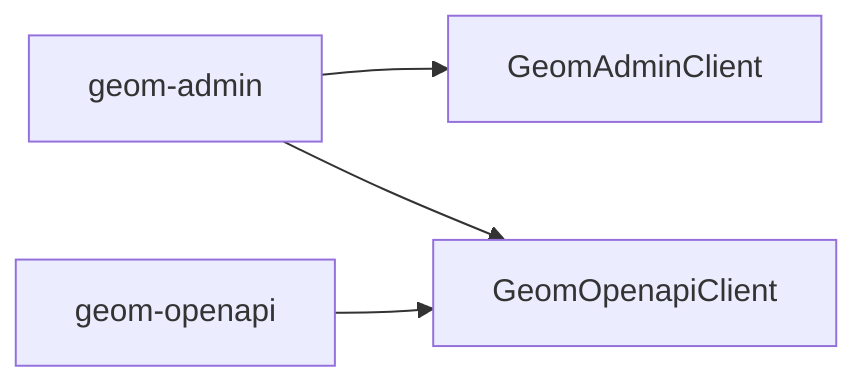

# 写给项目维护者

首先，向所有参与本项目的开发者致谢。

在本文档中，我将向您介绍如何参与 geom 项目前端部分的开发。

## 项目结构

```
geom(geom)
├── apps  # 服务目录
│   ├── admin(geom-app-admin)  # 后台管理服务
│   └── openapi(geom-app-openapi)  # 开放平台服务
├── eslint(eslint-config-geom)  # 共有的 eslint 配置
├── packages
│   ├── assets(@geom/assets)  # 静态资源
│   ├── components(@geom/components)  # 组件
│   └── util(@geom/util)  # 工具函数
└── sdk(@xezzon/geom)  # 提供前端调用后端的 API
    └── src
        ├── GeomAdminClient.ts  # 对应后端服务 admin
        └── GeomOpenapiClient.ts  # 对应后端服务 openapi
```

### 模块间依赖关系



## 如何运行

`TODO`

## 代码风格

`TODO`

## 如何提交您的代码

`TODO`
